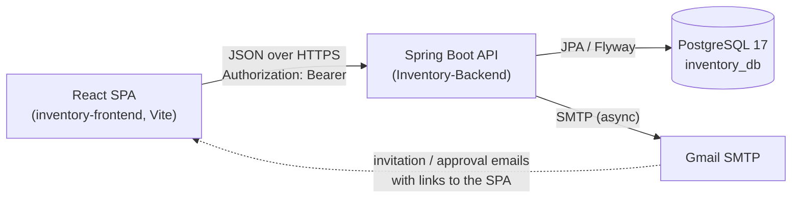
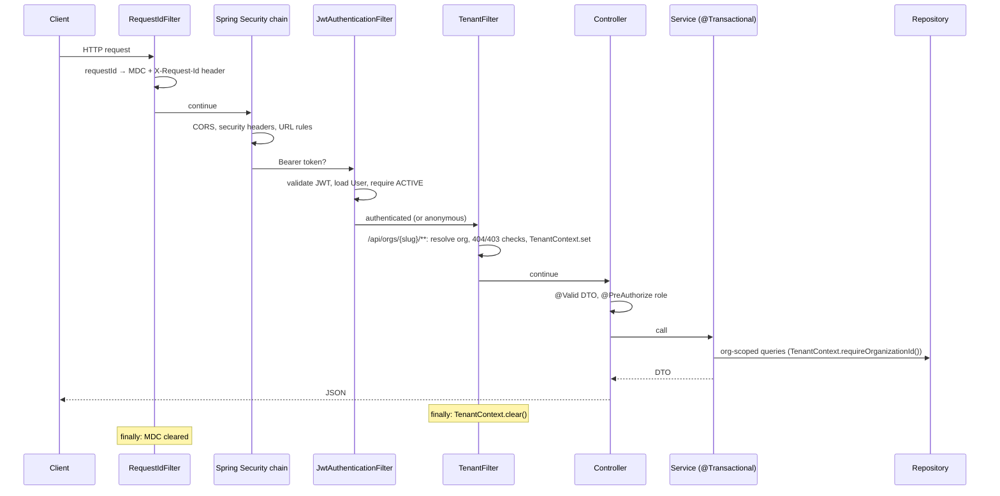

# StockWise Codebase Guide

How the StockWise backend (`Inventory-Backend`) and frontend (`inventory-frontend`) are built, how a request
flows through them, and where to make changes. Business behaviour is described in the StockWise Business Guide (https://claude.ai/artifact/LBwajqmzctbZEXPv9Cth3Q);
tables and migrations in [DATABASE.md](DATABASE.md); requirements and the change log in [../PRD.md](../PRD.md);
the frontend/backend contract in [../FRONTEND_INTEGRATION_PRD.md](../FRONTEND_INTEGRATION_PRD.md).

## 1. System at a glance



| Repo | Stack | Runs on |
| --- | --- | --- |
| `Inventory-Backend` | Java 21 (runs on 21+), Spring Boot 3.3.4, Spring Security, Spring Data JPA/Hibernate 6, Flyway 10.22, JJWT 0.12.6, springdoc 2.6, Spring Mail, Actuator | `http://localhost:8080` |
| `inventory-frontend` | React 19.3, React Router 7, Vite 8, Vitest, Testing Library, ESLint 9 | `http://localhost:5173` (dev) |

Three product areas share one API and one SPA:

| Area | SPA routes | API prefix | Who |
| --- | --- | --- | --- |
| Public | `/`, `/request-access`, `/invite/:token` | `/api/public/**` | anyone |
| Super admin ("platform") | `/platform/**` | `/api/platform/**` | `SUPER_ADMIN` only |
| Organization portal (tenant) | `/o/:slug/**` | `/api/orgs/{slug}/**` | members of that organization |

Token refresh/logout are shared: `/api/auth/refresh`, `/api/auth/logout`.

## 2. Backend

### 2.1 Package layout (`com.example.inventory`)

| Package | Responsibility | Key classes |
| --- | --- | --- |
| `controller` | HTTP mapping, request validation (`@Valid`, `@Validated`), method security (`@PreAuthorize`). No business logic. | `PublicController`, `PlatformController`, `OrgAuthController`, `AuthController`, `OrganizationController`, `ProductController`, `CategoryController`, `UserController`, `HealthController` |
| `service` | Business rules and transactions. The only layer that calls repositories. | `AuthService`, `RefreshTokenService`, `InvitationService`, `SubscriptionRequestService`, `PlatformOrganizationService`, `OrganizationService` (setup + CSV import), `UserService`, `CategoryService`, `ProductService`, `StockLedgerService`, `NotificationService`, `EmailService` |
| `repository` | Spring Data JPA interfaces; every tenant query takes an organization id. | `*Repository`, `ProductSpecifications` |
| `entity` | JPA entities and enums | `Organization`, `User`, `Category`, `Product`, `StockMovement`, `RefreshToken`, `Invitation`, `SubscriptionRequest`, `Role`, `UserStatus`, `OrganizationStatus`, `SubscriptionRequestStatus`, `StockMovementType` |
| `dto` | Request/response shapes (classes and records). Entities never leave the API. | `*Request`, `*Response`, `PageResponse<T>`, `ProductSummaryResponse`, `StockMovementResponse` |
| `security` | Authentication and tenancy plumbing | `JwtService`, `JwtAuthenticationFilter`, `TenantFilter`, `TenantContext`, `CurrentUser`, `CustomUserDetailsService` |
| `config` | Spring configuration and startup | `SecurityConfig`, `RequestIdFilter`, `DataInitializer`, `OpenApiConfig` |
| `exception` | Exception types and the single error mapper | `GlobalExceptionHandler`, `ErrorResponse`, `BadRequestException`, `ConflictException`, `ForbiddenException`, `ResourceNotFoundException`, `InsufficientStockException`, `TokenRefreshException` |
| `validation` | Password policy shared by annotations and startup checks | `PasswordPolicy`, `@StrongPassword`, `StrongPasswordValidator` |

Resources: `application.properties` (defaults, all overridable by env vars), `application-prod.properties`,
`application-local.properties` (gitignored secrets), `db/migration/V*.sql` (Flyway).

### 2.2 Request lifecycle



Any exception thrown on the way is turned into the standard error body by `GlobalExceptionHandler`
(or, for failures inside the security chain, by `SecurityConfig.writeError` / `TenantFilter.writeError`, which use
the same `ErrorResponse` shape).

### 2.3 Security

`SecurityConfig` builds one stateless filter chain:

- **Filters, in order:** `RequestIdFilter` (servlet filter, highest precedence) → CORS → `JwtAuthenticationFilter`
  (before `UsernamePasswordAuthenticationFilter`) → `TenantFilter` (added after the JWT filter; deliberately not a
  `@Component`, so it is not registered twice).
- **URL rules** (`authorizeHttpRequests`):
  - public: `/api/public/**`, `/api/auth/**`, `/api/platform/auth/login`, `/api/orgs/*/auth/**`, `/api/health`, `/actuator/health/**`, `/actuator/info`, Swagger;
  - `SUPER_ADMIN`: `/api/platform/**`;
  - `ADMIN`/`STAFF`: `GET` organization profile, product/category reads, `low-stock`, `summary`, stock in/out;
  - `ADMIN`: everything else under `/organization/**`, product/category writes, `/users/**`;
  - anything else: authenticated. Controllers repeat role checks with `@PreAuthorize` (`@EnableMethodSecurity`).
- **Headers:** CSP (`default-src 'self'`, `frame-ancestors 'none'`, …), `X-Frame-Options: DENY`, `nosniff`,
  `Referrer-Policy: no-referrer`, HSTS. CORS from `app.cors.allowed-origins`, credentials disabled, exposes `X-Request-Id`.
- **CSRF** is disabled on purpose: there is no cookie authentication, only the `Authorization` header.

**Tokens**

| Token | Format | Lifetime | Storage |
| --- | --- | --- | --- |
| Access | HS256 JWT signed with `jwt.secret`. Subject = email; claims `role`, `userId`, `name`, `orgId`, `orgSlug` | 15 min (`jwt.expiration`) | client memory/localStorage only |
| Refresh | 32 random bytes, Base64URL | 7 days from login (`jwt.refresh-token-expiration`), not extended by use | `refresh_tokens` table stores only the SHA-256 hash; one row per login session |

- `JwtService` refuses to start when the secret is missing, shorter than 32 bytes, or equal to the old sample key.
- `JwtAuthenticationFilter` accepts only the `Authorization: Bearer` header, loads the user, and authenticates only
  if `user.isEnabled()` (status `ACTIVE`), so disabling a user takes effect on the next request.
- `AuthService.login` (tenant) resolves the organization from `TenantContext`, authenticates the password, then
  requires membership of that organization (a mismatch returns the same `401` as a wrong password) and `ACTIVE`
  status (`403` with a status-specific message). `loginSuperAdmin` only accepts `SUPER_ADMIN`.
- `AuthService.refreshToken` re-checks that the user is active and the organization is active, then issues a new
  access token; the refresh token itself is not rotated. `logout` revokes one session; `UserService.disableUser`
  deletes all of a user's sessions.
- `CurrentUser` is the only class that reads the principal from the `SecurityContext`. Keep it that way: the
  planned OIDC/Keycloak change will replace the JWT filter and adapt this class.

### 2.4 Multi-tenancy

- Every tenant endpoint is under `/api/orgs/{orgSlug}/…`. `TenantFilter` matches that path, lower-cases the slug,
  loads the organization, and:
  - unknown slug → `404`; suspended organization → `403`;
  - authenticated caller from another organization (including the super admin, who has none) → `403`;
  - otherwise `TenantContext.set(orgId, slug)` for the request, cleared in `finally`.
- Services never take the organization from the client. They call `TenantContext.requireOrganizationId()` and use
  org-scoped repository methods (`findByIdAndOrganizationId`, `existsByOrganizationIdAndSku`, …). A record from
  another organization therefore looks like "not found".
- Uniqueness is per organization (category name, SKU); user email is global because one email = one account.

### 2.5 Business services

| Service | What it owns |
| --- | --- |
| `SubscriptionRequestService` | Create (emails StockWise + contact), list by status, reject with note (emails contact), `findPending` for approval |
| `PlatformOrganizationService` | Create organization (slug rules, reserved slugs, approves the linked request, optional admin invitation), list/get, suspend/activate, list admins, invite admin |
| `InvitationService` | Create invitation (ADMIN/STAFF only, 256-bit URL-safe token, expiry `app.invitation.expiry-days`, email), look up usable invitation, accept (creates `ACTIVE` user, marks accepted) |
| `AuthService` | Register (`PENDING` `STAFF`, emails admins + user), tenant login, super admin login, refresh, logout, email normalisation |
| `RefreshTokenService` | Create per-session hashed tokens (purges the user's expired/revoked rows), verify expiry, revoke, delete all for a user |
| `UserService` | Member lists by status, approve / reject / disable / enable with state checks, invite member; cannot disable yourself |
| `OrganizationService` | Organization profile, first-login setup, CSV import (parsing, per-row warnings, invitations, ledger entries) |
| `CategoryService` | CRUD, per-org case-insensitive uniqueness, product counts via one grouped query, delete blocked while products exist |
| `ProductService` | Paged search (Specifications + whitelisted sort), summary, CRUD, stale-edit check, stock in/out with row lock, low stock, history |
| `StockLedgerService` | Appends `StockMovement` rows inside the caller's transaction (`Propagation.MANDATORY`); paged history |
| `NotificationService` / `EmailService` | Compose all emails; send asynchronously (`@EnableAsync`, `@Async`); log instead of sending when `app.mail.enabled=false`; subjects stripped of CR/LF |

**Concurrency rules in `ProductService`**

- Stock in/out and product updates load the product with `ProductRepository.findForUpdate`
  (`PESSIMISTIC_WRITE`, a database row lock), so concurrent changes to one product queue up.
- `Product.version` (`@Version`) is optimistic locking. Clients send the `version` they edited; a mismatch throws
  `ConflictException` (409) before anything changes. Hibernate also bumps the version on every real change.
- Every quantity change calls `StockLedgerService.record(...)` in the same transaction.

**Search** uses `ProductSpecifications` (`inOrganization`, `nameOrSkuContains`, `inCategory`). A filter whose input
is empty returns `null` and adds no SQL. Do not reintroduce `(:param IS NULL OR …)` JPQL: PostgreSQL cannot type a
null parameter inside `LOWER(...)`, which caused a production 500 that H2 tests did not catch. `%`/`_` in search
text are escaped. Sort keys are whitelisted in `ProductService.SORTABLE`.

### 2.6 Errors

- Throw a domain exception from services; never build error responses in controllers.

| Exception | Status | Use for |
| --- | --- | --- |
| `BadRequestException` | 400 | Invalid input the annotations cannot express, business rules |
| `InsufficientStockException` | 400 (`error: "Insufficient Stock"`) | Stock-out beyond available |
| `ResourceNotFoundException` | 404 | Missing or other-tenant records |
| `ConflictException` | 409 | Duplicates, stale edits, delete blocked by dependants |
| `ForbiddenException` | 403 | Account/organization status |
| `TokenRefreshException` | 401 (`error: "Session Expired"`) | Refresh failures |

- `GlobalExceptionHandler` also maps validation (`MethodArgumentNotValidException`, `ConstraintViolationException`
  → `validationErrors` per field), malformed JSON, bad enum/number parameters, missing parameters/files, upload size
  (413), wrong method (405), media type (415), unknown endpoint (404), data integrity (409), optimistic/pessimistic
  lock failures (409), and anything else (500 with the request id as support reference; the stack trace is logged).
- Messages are written for end users. The frontend shows them verbatim.
- `ErrorResponse`: `{ timestamp, status, error, message, path, requestId, validationErrors? }`.

### 2.7 Configuration and profiles

- `application.properties` holds every setting with an env-var override (`${ENV:default}`); see `.env.example`.
  Required with no default: `JWT_SECRET`, `DB_PASSWORD`, and `SUPER_ADMIN_PASSWORD` for the first start.
- Profiles: `local` (default; loads gitignored `application-local.properties`), `prod` (API docs off,
  forwarded headers, graceful shutdown, Hikari connection timeout), `test` (`src/test/resources/application-test.properties`, H2).
- `DataInitializer` (a `CommandLineRunner`) seeds the super admin when none exists (password must pass
  `PasswordPolicy`) and, with `app.seed.demo-data=true` and no organizations, a `demo` organization with users,
  categories and products.
- Actuator exposes only `health` (with liveness/readiness groups, details hidden, mail indicator disabled) and `info`.
- Logging: every line carries `[requestId]` from the MDC (`logging.pattern.level`).

### 2.8 Tests (`src/test`)

| Test | Kind | Covers |
| --- | --- | --- |
| `AuthServiceTest`, `CategoryServiceTest`, `ProductServiceTest` | Mockito unit tests | Service rules without Spring |
| `PasswordPolicyTest` | Unit | Password rules |
| `ProductControllerTest` | `@SpringBootTest` + MockMvc | Roles, bearer auth, product endpoints |
| `MultiTenantFlowIntegrationTest` | Full stack | Subscription → organization → invitation → setup → CSV import → registration/approval → cross-tenant isolation |
| `SecurityAndErrorHandlingTest` | Full stack | Error shapes, password policy, sessions, cookie ignored, security headers |
| `InventoryIntegrityTest` | Full stack | Ledger, stale edits, 12 concurrent stock-outs, paging/sort validation, summary, request id, health probes |
| `InventoryApplicationTests` | Smoke | Context starts |

Tests run on H2 (PostgreSQL mode) with the real Flyway migrations and `ddl-auto=validate`; each Spring context gets
its own in-memory database (`testdb-${random.uuid}`). H2 is more lenient than PostgreSQL, so verify new queries
against PostgreSQL too (see §5).

### 2.9 Build, run, deliver

```powershell
.\mvnw.cmd test               # all tests
.\mvnw.cmd spring-boot:run    # local, profile "local", port 8080
```

- `Dockerfile`: multi-stage (Maven + Temurin 21 build, JRE 21 Alpine runtime), non-root user, health check on
  `/actuator/health/liveness`, profile `prod`, config from env vars only.
- `docker-compose.yml`: PostgreSQL 17 + API, reads `.env`.
- `.github/workflows/ci.yml`: `mvn -B verify` then `docker build` on pushes to `main` and on pull requests.

## 3. Frontend

### 3.1 Layout (`src/`)

| Path | Contents |
| --- | --- |
| `main.jsx` | React root, `BrowserRouter`, global CSS |
| `App.jsx` | Top-level routes; `ErrorBoundary` (reset on path change) + `Suspense`; lazy-loads the two portals |
| `areas/PlatformArea.jsx` | `/platform/*` routes inside `PlatformAuthProvider` |
| `areas/OrgArea.jsx` | `/o/:slug/*` routes inside `AuthProvider`; shows "Organization not found" for unknown/suspended slugs |
| `features/public` | `Landing` (org code lookup), `RequestAccess`, `AcceptInvitation`, `NotFound` |
| `features/platform` | `PlatformLogin`, `PlatformShell`, `Requests`, `Organizations`, `OrganizationDetail`, `CreateOrganizationModal` (exports `slugify`), `CopyButton`, `usePlatformAuth` |
| `features/auth` | Org `AuthProvider`/`useAuth`, `Login`, `Register`, `AlreadySignedIn` |
| `features/dashboard` | `Dashboard` (summary + low stock + org card) |
| `features/products` | `Products` (paged list), `ProductTable`, `ProductDetails` (stock form), `ProductForm` (create/edit, stale-edit handling), `StockHistory`, `StockBadge` |
| `features/categories` | `Categories` |
| `features/users` | `Users` (status tabs, approve/reject/disable/enable, invite modal) |
| `features/organization` | `OrganizationSetupModal`, `CsvImportModal`, `CsvUpload` |
| `shared/api/api.js` | The only module that talks to the backend |
| `shared/hooks` | `useAsync`, `useDebouncedValue` |
| `shared/components` | `Layout` (`Shell`, `AuthLayout`, `Page`), `ui` (`Field`, `Alert`, `Modal`, `Pagination`, `PasswordRules`, `Stat`, `Empty`, `Loading`, `StatusBadge`), `ErrorBoundary` |
| `shared/utils` | `errorUtils` (`errorText`, `errorTitle`, `fieldLabel`, `formErrors`), `formatters` (`money` INR, `niceDate`, `dateTime`) |
| `shared/styles/styles.css` | Single global stylesheet |
| `test/setup.js` | Vitest setup (jest-dom matchers, cleanup, clear localStorage) |

Each feature folder exports its public components from `index.js`.

### 3.2 API client (`shared/api/api.js`)

- `request(path, { scope, skipRefresh, ...fetchOptions })` adds JSON headers and `Authorization: Bearer` for the
  given scope, turns error bodies into `ApiError { status, message, validationErrors, payload }`, and network
  failures into `ApiError` with status 0.
- **Sessions** are stored per scope in `localStorage`: `stockwise_platform_session` and `stockwise_org_session`
  (`{ accessToken, refreshToken, user }`). A token is only ever sent to its own area.
  `sessions.watch(scope, cb)` listens to `storage` events so other tabs follow sign-ins and sign-outs.
- **On 401:** if another request already renewed the token, retry with it; otherwise call
  `refreshSession` (single-flight per scope: parallel 401s share one `/api/auth/refresh` call) and retry once. If
  refresh fails: clear the session and dispatch `auth:unauthorized` (providers reset their user).
- Clients: `publicApi`, `platformApi`, `orgApi(slug)`; `queryString(params)` skips empty values.

### 3.3 State and data loading

- `AuthProvider` (org portal) re-mounts per slug (keyed), and exposes `slug`, `api` (`orgApi(slug)`), `path()`,
  `organization`, `orgMissing`, `ready`, `user` (only if the stored session belongs to this slug), `orgStatus`,
  `refreshOrgStatus`, `login`, `register`, `logout`, `showOrgModal`. `PlatformAuthProvider` is the same idea for
  the super admin.
- **Always load data with `useAsync(load, deps)`**, not `useEffect` + `setState`. It ignores responses whose inputs
  changed or that arrive after unmount, keeps previous data while reloading (`loading` flag), and exposes
  `reload()` and `setData()`. The React hooks lint rules enforce this pattern.
- Search boxes use `useDebouncedValue` (250 ms); filter changes reset `page` to 0.

### 3.4 Forms and errors

- `Field` renders label + input/select/textarea with linked `id`, `aria-invalid`, `aria-describedby`; password inputs
  get the show/hide eye toggle; `wide` spans both grid columns.
- `formErrors(err)` spreads `validationErrors` into per-field messages plus `form` for the banner. `Alert` shows a
  status-based title and the server message, and lists field errors that have no input on screen (`inlineFields`).
- Password forms use `PasswordRules` / `isStrongPassword`, which mirror the backend `PasswordPolicy`.
- `ProductForm` sends the product `version`; on the stale-edit 409 it offers "Load the latest version".

### 3.5 Build, security, tests

| Command | Purpose |
| --- | --- |
| `npm run dev` | Dev server (5173) |
| `npm run lint` | ESLint flat config (`eslint.config.js`) |
| `npm test` | Vitest (jsdom): `api.test.js`, `useAsync.test.jsx`, `ui.test.jsx` |
| `npm run build` | Production bundle; injects a CSP meta tag (`vite.config.js`) allowing only same-origin scripts, Google Fonts and the API origin |
| `npm run check` | lint + test + build (what CI runs, plus `npm audit --omit=dev`) |

- Only `VITE_API_BASE_URL` is read at build time. Never put secrets in `VITE_*` variables.
- Dependencies are pinned to exact versions.

## 4. Conventions

- **Backend:** constructor injection; `@Transactional(readOnly = true)` on reads; DTOs in and out; tenant data only
  via `TenantContext`; user-facing messages in exceptions; migrations for every schema change; no secrets in
  tracked files (use env vars or `application-local.properties`).
- **Frontend:** API calls only through `shared/api`; data through `useAsync`; errors through `Alert` and `formErrors`;
  one component per file; feature code stays in its feature folder, shared code in `shared/`.
- **Docs:** update `PRD.md` (requirements + change record), `FRONTEND_INTEGRATION_PRD.md` (copied to the frontend
  repo) and the Postman collection when behaviour or contracts change.

## 5. How to…

**Add a tenant feature (e.g. suppliers)**
1. Migration `V{n}__suppliers.sql` with `organization_id` FK and per-org unique constraints.
2. Entity + repository with `…AndOrganizationId` methods.
3. Service using `TenantContext.requireOrganizationId()`, domain exceptions, `@Transactional`.
4. DTOs with validation messages; controller under `/api/orgs/{orgSlug}/…` with `@PreAuthorize`.
5. URL rules in `SecurityConfig` if the path is new.
6. Tests: service unit test + an integration test that includes a cross-organization access check.
7. Frontend: `orgApi` methods, feature folder, route in `areas/OrgArea.jsx`, nav entry in `Shell`.
8. Update PRD, integration PRD and Postman.

**Change the schema:** see [DATABASE.md](DATABASE.md#6-changing-the-schema).

**Verify a query on PostgreSQL:** create a scratch database, start the API against it with demo data, exercise the
endpoint, then drop the database:

```powershell
.\mvnw.cmd spring-boot:run "-Dspring-boot.run.arguments=--server.port=8082 --spring.datasource.url=jdbc:postgresql://localhost:5432/inventory_verify --app.seed.demo-data=true --app.mail.enabled=false"
```

## 6. Known gaps and planned work

- OIDC with Keycloak will replace the in-house login, JWTs and refresh tokens (touch points: `SecurityConfig`,
  `JwtAuthenticationFilter`, `CurrentUser`, `AuthService`, the SPA's `api.js` session handling).
- No login rate limiting (Keycloak brute-force detection planned); registration reveals existing emails.
- CSV import does not apply the product form's SKU format and length rules (a too-long value fails the whole import).
- Tests use H2; running them on PostgreSQL (Testcontainers or embedded PostgreSQL) is planned.
- No password reset, invitation list/cancel, member deletion or role change.
