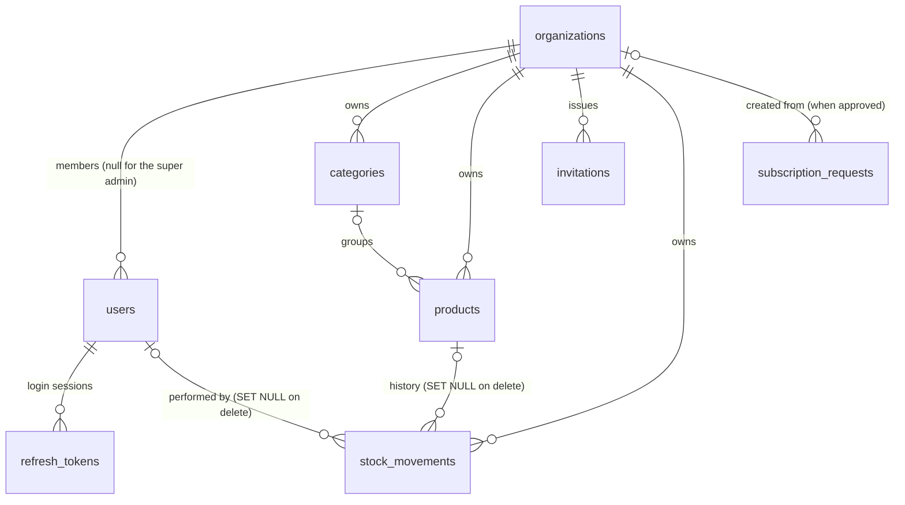

# StockWise Database Guide

Tables, columns, keys, indexes, migrations and data rules of the StockWise PostgreSQL database. Taken from the live
schema (Flyway version 2) and the JPA entities in `src/main/java/com/example/inventory/entity`. Application
behaviour is in the StockWise Business Guide; code structure in [CODEBASE.md](CODEBASE.md).

## 1. Overview

| Item | Value |
| --- | --- |
| Engine | PostgreSQL 17 (tests: H2 2.x in PostgreSQL mode, same migrations) |
| Database | `inventory_db` (`DB_NAME`), schema `public` |
| Connection | `jdbc:postgresql://${DB_HOST:localhost}:${DB_PORT:5432}/${DB_NAME:inventory_db}`, user `DB_USERNAME` (default `postgres`), password `DB_PASSWORD` (required) |
| Schema owner | Flyway: `src/main/resources/db/migration`, history in `flyway_schema_history` |
| Hibernate | `ddl-auto=validate`: never changes the schema; startup fails if entities and tables disagree |
| Primary keys | `BIGINT GENERATED BY DEFAULT AS IDENTITY` on every table |
| Enumerations | Stored as `VARCHAR` text (`@Enumerated(STRING)`) with `CHECK` constraints listing the allowed values |
| Tenancy | Every business table carries `organization_id`; the application scopes every query by it |

## 2. Entity relationships



Tables in dependency order: `organizations` → `users`, `categories`, `invitations`, `subscription_requests` →
`products` → `stock_movements`, `refresh_tokens`.

## 3. Tables

Columns are listed in the order of the live table. "Default" is a database default; values the application fills in
are noted under Meaning.

### 3.1 `organizations`
A client business and its portal address.

| Column | Type | Null | Default | Meaning |
| --- | --- | --- | --- | --- |
| `id` | bigint identity | no | | Primary key |
| `contact_email` | varchar(255) | yes | | Business contact, stored lower case |
| `created_at` | timestamp | no | | Set on insert |
| `description` | varchar(1000) | yes | | Free text |
| `name` | varchar(255) | no | | Display name |
| `setup_completed` | boolean | no | | `false` until the first-login setup is finished (fresh start or CSV import) |
| `slug` | varchar(63) | no | | Portal code in `/o/{slug}`; lower case, `^[a-z0-9](?:[a-z0-9-]{1,61}[a-z0-9])$`, reserved words blocked by the application |
| `status` | varchar(20) | no | | `ACTIVE` or `SUSPENDED` |
| `updated_at` | timestamp | no | | Set on insert and update |

Constraints: PK `organizations_pkey`; unique `slug`; check `organizations_status_check`.

### 3.2 `users`
Every account: the super admin and all organization members.

| Column | Type | Null | Default | Meaning |
| --- | --- | --- | --- | --- |
| `id` | bigint identity | no | | Primary key |
| `created_at` | timestamp | no | | Set on insert |
| `email` | varchar(255) | no | | Login name, lower case, unique across all organizations |
| `name` | varchar(255) | no | | Display name (the API accepts 2-100 characters) |
| `password` | varchar(255) | no | | BCrypt hash, never the plain password |
| `role` | varchar(255) | no | | `SUPER_ADMIN`, `ADMIN` or `STAFF` |
| `status` | varchar(20) | no | | `PENDING`, `ACTIVE`, `REJECTED` or `DISABLED`; only `ACTIVE` can sign in |
| `organization_id` | bigint | yes | | FK → `organizations.id`; `NULL` only for the super admin |

Constraints: PK; unique `email`; FK `organization_id`; checks `users_role_check`, `users_status_check`.
Index: `idx_users_organization (organization_id)`.

### 3.3 `categories`

| Column | Type | Null | Default | Meaning |
| --- | --- | --- | --- | --- |
| `id` | bigint identity | no | | Primary key |
| `description` | text | yes | | API limit 1,000 characters |
| `name` | varchar(255) | no | | API limit 2-100 characters; unique per organization (the application also compares case-insensitively) |
| `organization_id` | bigint | no | | FK → `organizations.id` |

Constraints: PK; unique `uk_categories_org_name (organization_id, name)`; FK `organization_id`.

### 3.4 `products`

| Column | Type | Null | Default | Meaning |
| --- | --- | --- | --- | --- |
| `id` | bigint identity | no | | Primary key |
| `created_at` | timestamp | no | | Set on insert |
| `description` | text | yes | | API limit 2,000 characters |
| `minimum_stock` | integer | no | | Low-stock threshold; the product is low stock when `quantity <= minimum_stock` |
| `name` | varchar(255) | no | | Product name |
| `price` | numeric(12,2) | no | | Unit price in INR, ≥ 0 (enforced by the application) |
| `quantity` | integer | no | | Current stock, never negative (enforced by the application), max 1,000,000,000 |
| `sku` | varchar(255) | no | | Stored upper case; unique per organization; API limit 100 characters and `^[A-Za-z0-9][A-Za-z0-9._-]*$` |
| `updated_at` | timestamp | yes | | Set on insert and update |
| `category_id` | bigint | yes | | FK → `categories.id`; the API always sets it, CSV rows without a category leave it `NULL` |
| `organization_id` | bigint | no | | FK → `organizations.id` |
| `version` | bigint | no | `0` | Optimistic lock (`@Version`); incremented on every change; clients send it back to detect stale edits |

Constraints: PK; unique `uk_products_org_sku (organization_id, sku)`; FKs `organization_id`, `category_id`.
Index: `idx_products_category (category_id)`. The unique `(organization_id, sku)` index also serves tenant lookups.

### 3.5 `stock_movements`
Append-only stock ledger: one row per change to a product's quantity. Rows are never updated (`updatable = false`
on every column) and never deleted by the application.

| Column | Type | Null | Default | Meaning |
| --- | --- | --- | --- | --- |
| `id` | bigint identity | no | | Primary key |
| `organization_id` | bigint | no | | FK → `organizations.id` |
| `product_id` | bigint | yes | | FK → `products.id`, **`ON DELETE SET NULL`**: history survives product deletion |
| `product_sku` | varchar(255) | no | | SKU copied at the time of the movement |
| `product_name` | varchar(255) | no | | Name copied at the time of the movement |
| `type` | varchar(20) | no | | `INITIAL`, `STOCK_IN`, `STOCK_OUT`, `ADJUSTMENT`, `IMPORT` |
| `quantity_change` | integer | no | | Signed: positive added, negative removed |
| `quantity_after` | integer | no | | Product quantity after this movement |
| `notes` | varchar(500) | yes | | User notes (trimmed; blank stored as `NULL`) |
| `performed_by_id` | bigint | yes | | FK → `users.id`, **`ON DELETE SET NULL`**; `NULL` if no signed-in user made the change |
| `performed_by_name` | varchar(255) | yes | | User name copied at the time |
| `created_at` | timestamptz | no | | Set on insert |

Constraints: PK; FKs above; check `stock_movements_type_check`.
Index: `idx_stock_movements_product (organization_id, product_id, created_at)` for the per-product history.

Invariant: for each product, the latest movement's `quantity_after` equals `products.quantity`, and the sum of
`quantity_change` equals it too (for products created after V2; see §7).

### 3.6 `refresh_tokens`
One row per login session.

| Column | Type | Null | Default | Meaning |
| --- | --- | --- | --- | --- |
| `id` | bigint identity | no | | Primary key |
| `created_at` | timestamptz | no | | Login time |
| `expiry_date` | timestamptz | no | | Login time + 7 days (`JWT_REFRESH_TOKEN_EXPIRATION`); not extended by use |
| `revoked` | boolean | no | | `true` after logout |
| `token` | varchar(64) | no | | **SHA-256 hex hash** of the refresh token; the raw token is only ever held by the client |
| `user_id` | bigint | no | | FK → `users.id` |

Constraints: PK; unique `token`; FK `user_id`. Index `idx_refresh_tokens_user (user_id)`.
Cleanup: on each login the user's expired and revoked rows are deleted; disabling a user deletes all of their rows.

### 3.7 `invitations`

| Column | Type | Null | Default | Meaning |
| --- | --- | --- | --- | --- |
| `id` | bigint identity | no | | Primary key |
| `accepted_at` | timestamp | yes | | Set when used; a used invitation cannot be used again |
| `created_at` | timestamp | no | | Set on insert |
| `email` | varchar(255) | no | | Invitee, lower case |
| `expires_at` | timestamp | no | | `created_at` + `INVITATION_EXPIRY_DAYS` (default 7) |
| `name` | varchar(255) | yes | | Optional invitee name |
| `role` | varchar(20) | no | | `ADMIN` or `STAFF` (the check also allows `SUPER_ADMIN`, the application never issues it) |
| `token` | varchar(64) | no | | Random 256-bit URL-safe token used in the email link |
| `organization_id` | bigint | no | | FK → `organizations.id` |

Constraints: PK; unique `token`; FK `organization_id`; check `invitations_role_check`.
Indexes: `idx_invitations_organization`, `idx_invitations_email` (used for "already has a pending invitation").
An invitation is *usable* when `accepted_at IS NULL AND expires_at > now()`.

### 3.8 `subscription_requests`

| Column | Type | Null | Default | Meaning |
| --- | --- | --- | --- | --- |
| `id` | bigint identity | no | | Primary key |
| `contact_email` | varchar(255) | no | | |
| `contact_name` | varchar(255) | no | | API limit 100 characters |
| `contact_phone` | varchar(50) | yes | | |
| `created_at` | timestamp | no | | Set on insert |
| `has_existing_data` | boolean | no | | The business wants to import a CSV |
| `message` | text | yes | | API limit 2,000 characters |
| `organization_name` | varchar(255) | no | | |
| `review_note` | varchar(1000) | yes | | Optional rejection note, included in the email |
| `reviewed_at` | timestamp | yes | | Set on approval or rejection |
| `status` | varchar(20) | no | | `PENDING`, `APPROVED`, `REJECTED` |
| `organization_id` | bigint | yes | | FK → `organizations.id`, set when approved by creating the organization |

Constraints: PK; FK `organization_id`; check `subscription_requests_status_check`.
Index: `idx_subscription_requests_status (status)`.

### 3.9 `flyway_schema_history`
Managed by Flyway; do not edit by hand. Current contents of `inventory_db`:

| Rank | Version | Description | Type |
| --- | --- | --- | --- |
| 1 | 1 | `<< Flyway Baseline >>` | BASELINE (existing database adopted on 2026-09-29) |
| 2 | 2 | stock ledger and integrity | SQL |

## 4. Migrations

| Version | File | Contents |
| --- | --- | --- |
| V1 | `V1__baseline.sql` | All tables as they existed before Flyway: `organizations`, `users`, `categories`, `products`, `refresh_tokens`, `invitations`, `subscription_requests`, with their keys and checks. Runs only on an empty database. |
| V2 | `V2__stock_ledger_and_integrity.sql` | `products.version`; `refresh_tokens.user_id` made `NOT NULL` (orphans deleted first); indexes on `users.organization_id`, `products.category_id`, `invitations.organization_id`, `invitations.email`, `subscription_requests.status`; new `stock_movements` table and index |

Configuration: `spring.flyway.enabled=true`, `baseline-on-migrate=true`, `baseline-version=1`. A database that
already has tables but no history table is recorded as version 1 without running V1, then V2+ run normally.

## 5. How the application uses the data

| Feature | Tables | Query pattern |
| --- | --- | --- |
| Tenant resolution | `organizations` | `WHERE slug = ?` on every `/api/orgs/{slug}` request |
| Sign-in | `users`, `refresh_tokens` | user by `email`; insert one session row |
| Token refresh | `refresh_tokens`, `users`, `organizations` | session by `token` (hash), then user and organization status |
| Product list | `products` ⟕ `categories` | `organization_id = ?` plus optional `LOWER(name/sku) LIKE ?` and `category_id = ?`, `ORDER BY` a whitelisted column then `id`, `LIMIT/OFFSET` + `COUNT(*)`; category fetched in the same query |
| Dashboard summary | `products` | one aggregate: `COUNT`, `SUM(quantity)`, `SUM(price*quantity)`, `SUM(CASE quantity<=minimum_stock)` |
| Low stock | `products` ⟕ `categories` | `quantity <= minimum_stock ORDER BY quantity, name` |
| Category list | `categories`, `products` | categories by org + one `GROUP BY category_id` count |
| Stock in/out, product edit | `products`, `stock_movements` | `SELECT … FOR UPDATE`-style row lock on the product, update with `version` check, insert movement, one transaction |
| Stock history | `stock_movements` | `organization_id = ? AND product_id = ? ORDER BY created_at DESC, id DESC` paged |
| CSV import | `categories`, `products`, `stock_movements`, `invitations`, `users` | one transaction per file; existence checks per row |

## 6. Changing the schema

1. Add `src/main/resources/db/migration/V{next}__short_description.sql`. Never edit or rename an applied
   migration; Flyway checks their checksums.
2. Write SQL that runs on both PostgreSQL and H2 (PostgreSQL mode): standard `CREATE/ALTER`, identity columns,
   `CHECK (col IN (...))`, `ON DELETE …`. Avoid PostgreSQL-only syntax, or the tests fail.
3. Give constraints and indexes explicit names (`uk_…`, `fk_…`, `idx_…`, `…_check`). Do not reference the
   auto-generated names of pre-Flyway constraints (see §7).
4. Update the entity so `ddl-auto=validate` passes (types, lengths, nullability).
5. Adding a value to an enum stored as text also needs a migration that recreates the `CHECK` constraint.
6. Run `.\mvnw.cmd test` (applies all migrations to H2 and validates), then start the API against a copy of the
   PostgreSQL database before production.
7. Update this document.

Backup and restore (PostgreSQL client tools):

```powershell
pg_dump -h localhost -U postgres -d inventory_db -Fc -f inventory_db.dump      # backup
pg_restore -h localhost -U postgres -d inventory_db_restored inventory_db.dump  # restore into an empty database
```

## 7. Known quirks

- **Constraint names differ between databases.** `inventory_db` was created by Hibernate before Flyway, so its
  unique and foreign-key constraints have generated names (e.g. `uk6dotkott2kjsp8vw4d0m25fb7` on `users.email`).
  A database created from V1 has readable names (`uk_users_email`, `fk_users_organization`, …). Behaviour is the
  same; migrations must not drop constraints by name without handling both.
- **Timestamps.** `stock_movements.created_at` and `refresh_tokens.*` are `timestamptz` (Java `Instant`, UTC-safe).
  The other tables use `timestamp` without time zone (Java `LocalDateTime`) holding the server's local time (IST on
  the current machine). Run servers in one time zone, or migrate these columns to `timestamptz`.
- **Column sizes vs API limits.** Several columns are wider than the API allows (`categories.name` 255 vs 100,
  `products.sku` 255 vs 100, `users.name` 255 vs 100, `users.role` 255). The API limits are the effective rules;
  the CSV import does not yet apply them.
- **Ledger coverage.** Products created before V2 (2026-09-29) and the products seeded by `SEED_DEMO_DATA` have no
  `INITIAL` movement, so their history starts with their first stock change.
- **No cascades from organizations.** Deleting an organization is not supported; foreign keys would block it while
  it has members, products or invitations.
- **Category deletion** is blocked by the application while products reference it; the database FK
  `products.category_id` would also refuse it.
